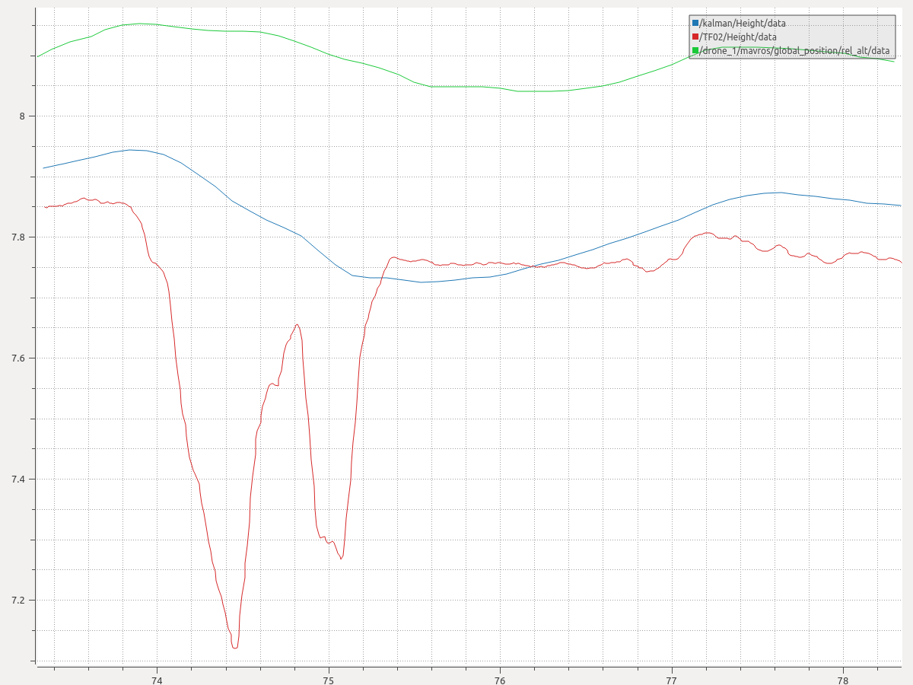

# kalman_filter
### a realize of kalman_filter as a ros package using numpy

* **激光测距**受地面状况（草地、石头）影响，容易出现较大起伏。气压计测得的是海拔，不能得到对地面的高度
*  因此用垂直方向上的速度信息建立模型预估地面高度，再用激光测距值作为观测，利用**卡尔曼滤波器**得到对地高度的最优估计
------
## 效果图：

* 绿色线是飞机气压计处理得到的高度，是相对起飞海拔的高度
* 红色线是云台上的单线激光测距仪的测量高度，是含噪声的对地高度
* 蓝色线是kalman滤波结果，既滤除了激光数据中的噪声，又克服了气压计方法不可避免的静态误差

## 使用
`rosrun kalman kalman_filter_node.py`  
*(注意话题名映射)*